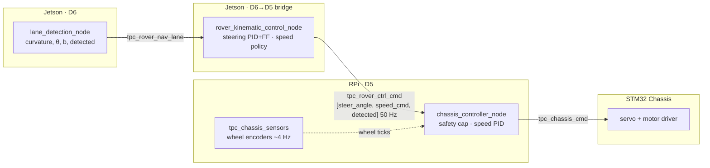
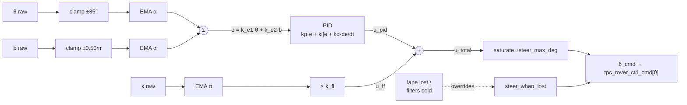
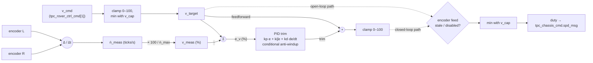

# Control Law

> **This documents the ROS 2 system that branch `rs` replaced.** It is kept
> because the derivations and field-tuned constants in it are expensive to
> regenerate, not because it describes what runs now. For the current system
> see [RUST_REWRITE_PLAN.md](RUST_REWRITE_PLAN.md) (§13 is authoritative) and
> [HARDWARE.md](HARDWARE.md).
>
> ⚠️ **This document describes a full PID (`k_e1`, `k_e2`, `k_p`, `k_i`,
> `k_d`, `k_ff`) that `rover_kinematic_control_node.py` never actually
> implemented.** The port in `crates/rover-control/src/guide.rs` follows the
> code, not this document. That drift predates the rewrite and exists on
> `main` too — see `REWRITE_SUMMARY.md` §7.

Steering and speed control law implemented across the vision (Jetson, D6/D5)
and chassis (RPi, D5) nodes. The D4/D5/D6 domain topology and the `tpc_*`
schemas the tables below reference were deleted with the ROS 2 tree —
`git show main:docs/DOMAINS.md` and `git show main:docs/TOPICS.md` still have
them. For current wire types see `crates/rover-msgs`; for the machines and IPs
those domains used to run on see [HARDWARE.md](HARDWARE.md).

## Overview

Control is split across two processes on two machines, cascaded through one
shared command topic:

1. **`rover_kinematic_control_node.py` (Jetson, D6→D5)** — turns lane
   geometry into a steering angle and a speed *request*. Runs at the lane
   detection rate.
2. **`chassis_controller_node.cpp` (RPi, D5)** — turns that request into an
   actual motor command. Steering is a straight passthrough (angle → servo
   direction/magnitude). Speed is closed-loop: a PID corrects PWM duty
   against wheel-encoder feedback so terrain load doesn't silently slow the
   rover below the requested speed.

---

## 1. Steering Control Law

**File:** `ws_jetson/src/vision_navigation/vision_navigation/rover_kinematic_control_node.py`
**Config:** `ws_jetson/src/vision_navigation/config/rover_kinematic_control_params.yaml`

Feedback (PID on heading + lateral error) combined with feedforward
(proportional to curve sharpness ahead), so the rover starts steering into a
curve before heading/offset error alone would build up enough to react.

### Inputs (from `tpc_rover_nav_lane`)

| Symbol | Field | Meaning |
|---|---|---|
| `κ` | curvature | Parabola coefficient A of the fitted lane, `x = A·y² + B·y + C`, in the fit's native BEV pixels (1/px) — NOT converted to a real 1/m arc on the wire. Metric: `R = 1/(2·A·S)`, `S` = 200 px/m |
| `θ` | theta_deg | Heading error, real degrees (+ = needs right turn) |
| `b` | b_offset | Lateral offset from lane center, **metres** (converted from the fit's native BEV pixels by `lane_detector.py` before publishing — unlike `κ`, which is left in pixels for consumers to convert) |

`θ` and `b` are physical quantities, not canvas-dependent numbers — the
bird's-eye view is isotropic. See [VISION_PIPELINE.md](VISION_PIPELINE.md)
for how they are produced. Note that `b` and `κ` are measured at a **1.22 m
lookahead ahead of the front axle**, not at the rover, so they encode partly
the same information; tune `k_p` on `θ` first, then `k_e2`, then `k_ff`.
| `detected` | detected_flag | Raw vision detection validity |

Each raw input is clamped before filtering to keep a single bad frame from
spiking the low-pass state: `θ ∈ [-35°, 35°]`, `b ∈ [-0.50, 0.50] m`.

### 1.1 Low-pass filtering (EMA)

All three signals are smoothed with an exponential moving average before
use, gain `α = ema_alpha`:

$$
x_{\text{ema}}[k] = \alpha \, x[k] + (1-\alpha)\, x_{\text{ema}}[k-1]
$$

applied independently to `θ`, `b`, and `κ`. The filter is treated as
"warmed up" only once its internal history buffer (30 samples) is full;
until then the command falls back to the lost-lane policy even if
`detected = true`.

**The filters and the PID are updated only on frames where the lane is
actually detected.** On a lost frame their state is held, not advanced.
Updating them unconditionally means the lane-lost placeholder value drags
the filters away from the last real measurement while the lane is missing,
so the instant detection returns the rover steers on fabricated error.
Non-finite geometry (NaN) is likewise treated as "not detected" rather
than being fed to the filters — see §4.

### 1.2 Feedback term — combined-error PID

$$
e[k] = k_{e1}\,\theta_{\text{ema}}[k] + k_{e2}\,b_{\text{ema}}[k]
$$

$$
u_{\text{pid}}[k] = k_p\,e[k] \;+\; k_i \sum_{j\le k} e[j]\,\Delta t_j \;+\; k_d\,\frac{e[k]-e[k-1]}{\Delta t_k}
$$

Integral term is clamped to `±200` (anti-windup) before being multiplied by `k_i`.

### 1.3 Feedforward term — anticipate the curve

$$
u_{\text{ff}}[k] = k_{ff} \, \kappa_{\text{ema}}[k]
$$

### 1.4 Combined output and saturation

$$
u_{\text{total}}[k] = u_{\text{pid}}[k] + u_{\text{ff}}[k]
$$

$$
\delta_{\text{cmd}}[k] =
\begin{cases}
\text{clamp}\big(u_{\text{total}}[k],\, -\delta_{\text{max}},\, \delta_{\text{max}}\big) & \text{lane detected, filters warmed up} \\
\delta_{\text{lost}} & \text{otherwise}
\end{cases}
$$

`δ_cmd` (degrees, + = right / − = left) is published as `data[0]` of
`tpc_rover_ctrl_cmd`. `chassis_controller_node` on the RPi does no further
shaping — it only maps sign → turn direction (`fdr_msg`) and forwards
`|δ_cmd|` as `ro_ctrl_msg` to the STM32 servo driver.

### 1.5 Block diagram

### 1.6 Current gains (as configured)

| Param | Value | Role |
|---|---|---|
| `k_e1` | 1.0 | heading-error weight |
| `k_e2` | 20.0 | lateral-offset weight (`b` is metres; 20.0 = the old 0.1 rescaled ×`BEV_PX_PER_M`, so `e` is numerically the same as before for the same physical offset) |
| `k_p` | 4.0 | proportional |
| `k_i` | 0.01 | integral |
| `k_d` | 0.01 | derivative |
| `k_ff` | 0.0 | feedforward on curvature — **derived value 11172.7**, see below |
| `ema_alpha` | 0.05 | filter smoothing |
| `steer_max_deg` | ±60° | output saturation |
| `steer_when_lost` | 0.0° | safety default, straight |

### 1.7 Deriving `k_ff`

Because the bird's-eye view is metric, the feedforward gain is calculable
rather than tuned by hand. The fitted coefficient gives the arc radius as
`A = 1/(2·R·S)`, and Ackermann geometry needs `δ = arctan(L/R)` to hold it,
so for small `δ`:

$$
k_{ff} = 2 S L \frac{180}{\pi}
       = 2 \times 200 \times 0.4875 \times 57.2958
       = 11172.7
$$

with `S = 200 px/m` and wheelbase `L = 0.4875 m` (48.75 cm). Checked against
exact Ackermann: `R` = 10 m → 2.79° (exact 2.79), 20 m → 1.40° (exact 1.40),
36.5 m → 0.77° (exact 0.76).

**Shipped at 0.0.** On a 400 m running track (bend radius ≈ 36.5 m) the
correct feedforward contribution is only ~0.77°, while a momentarily bad
curvature fit multiplied by 11172.7 would inject a large steering kick.
Feedback alone covers this track. Raise toward 11172.7 only once the logs
show `curvature_ema` is clean and stable through the bends.

> Recomputed 2026-08-04 for the corrected wheelbase (48.75 cm, was
> documented as 50 cm). `regenerate_roi.py` (formerly in
> `ws_jetson/src/vision_navigation/vision_navigation/`, its `compute_k_ff()`
> did this recomputation) was deleted with the ROS 2 tree —
> `git show main:ws_jetson/src/vision_navigation/vision_navigation/regenerate_roi.py`
> recovers it. If the wheelbase or `BEV_PX_PER_M` changes again, the formula
> above is for **checking** a redone value by hand, not a substitute for
> running the script.

---

## 2. Speed Control Law

Speed is set in two stages: a **request** computed on the Jetson from
detection state, then a **closed-loop correction** applied on the RPi
against wheel-encoder feedback. Both stages share the same unit: 0–100 %
PWM duty cycle (`motor_duty = speed_percent / 100.0` on the STM32).

### 2.1 Stage 1 — detection-based speed request (Jetson)

**File:** `rover_kinematic_control_node.py::_compute_speed_cmd`

$$
v_{\text{cmd}} =
\begin{cases}
v_{ref} & \text{lane detected} \\
v_{ref}\cdot r_{\text{lost}} & \text{lost, elapsed} < T_{\text{timeout}} \\
0 & \text{lost, elapsed} \ge T_{\text{timeout}}
\end{cases}
$$

This is open-loop with respect to actual chassis speed — it only reacts to
*lane visibility*, not to how fast the wheels are actually turning. `v_cmd`
is published as `data[1]` of `tpc_rover_ctrl_cmd`.

| Param | Value | Role |
|---|---|---|
| `speed_ref` | 16 % | nominal cruise duty when lane detected |
| `speed_lost_ratio` | 0.5 | caution-speed multiplier while lane briefly lost |
| `detection_timeout_sec` | 10.0 s | time lost before full stop |

### 2.2 Stage 2 — closed-loop duty correction (RPi)

**File:** `ws_rpi/src/chassis_control/src/chassis_controller_node.cpp`
**Config:** `ws_rpi/src/chassis_control/config/chassis_speed_control_params.yaml`

`v_cmd` is first clamped by the operator safety cap (`srv_spd_limit`):

$$
v_{\text{target}} = \min\big(\text{clamp}(v_{\text{cmd}}, 0, 100),\; v_{\text{cap}}\big)
$$

Wheel-encoder deltas (`tpc_chassis_sensors`, ~4 Hz) give a measured tick
rate:

$$
\dot n_{\text{meas}}[k] = \frac{(\Delta N_L + \Delta N_R)/2}{\Delta t}
$$

> **Why averaging is correct even mid-turn:** both encoders sit on the rear
> axle, and steering is applied only at the front wheels (Ackermann). The
> instantaneous center of rotation therefore always lies on the line through
> the rear axle, so the two rear wheel speeds are exactly `v_center ∓ Δ`,
> symmetric around the true centerline speed, at any steering angle — no
> small-angle approximation needed. Left/right tick-rate divergence while
> turning is expected geometry, not sensor error, and it cancels out exactly
> in `ṅ_meas`. `measured_left_tps`/`measured_right_tps` are published to
> `tpc_chassis_speed_debug` for logging only; the PID never needs to look at
> the split, and no extra tolerance is required for it to regulate forward
> speed correctly through curves. (A per-wheel expected-divergence check —
> useful for detecting a slipping or stuck wheel — would be a separate
> addition; it isn't implemented today.)

The measured rate is then normalised into the same 0–100 % unit as the
output, using the flat-ground calibration constant `ṅ_max`:

$$
v_{\text{meas}}[k] = 100\cdot\frac{\dot n_{\text{meas}}[k]}{\dot n_{\text{max}}}
\qquad
e_v[k] = v_{\text{target}} - v_{\text{meas}}[k]
$$

Working in percent rather than raw ticks/s is deliberate: the gains are then
independent of `ṅ_max`, so re-calibrating it doesn't silently rescale the
loop.

**Feedforward + PID trim.** The commanded duty is itself the feedforward
term; the PID only corrects for load:

$$
u_v[k] = \underbrace{v_{\text{target}}}_{\text{feedforward}} \;+\; \underbrace{k_p^{v}\,e_v[k] \;+\; k_i^{v}\sum_{j\le k} e_v[j]\,\Delta t_j \;+\; k_d^{v}\,\frac{e_v[k]-e_v[k-1]}{\Delta t_k}}_{\text{PID trim}}
$$

At zero error this emits exactly what open-loop would have sent, so a
healthy loop degrades gracefully toward open-loop behaviour rather than
away from it. The integral is bounded by `±speed_integral_limit`, giving it
`k_i × limit` of duty authority (currently ±50 %), and uses conditional
integration — accumulation stops once the output is saturated and the error
would only push it further out of range, so an unreachable setpoint (e.g.
climbing at full throttle) doesn't wind up a lurch for when traction
returns.

> **Why feedforward, not pure PID:** with no feedforward the integral has to
> supply the entire operating point on its own, which makes the anti-windup
> clamp double as a ceiling on reachable speed. That was a real defect here:
> at the original `speed_ki = 0.01` with `speed_integral_limit = 200` the integral could
> contribute at most 2 % duty, so a commanded 50 % settled at ~18 % — about
> a third of the intended speed, and *worse than the open-loop path it
> replaced*. No value of `ṅ_max` fixes it; the structure has to change.

Final outgoing duty, safety cap applied last regardless of PID overshoot:

$$
\text{duty}[k] = \min\Big(\text{clamp}\big(u_v[k],\,0,\,100\big),\; v_{\text{cap}}\Big)
$$

> **The loop starts open and enables itself once calibrated.** An uncalibrated
> `ṅ_max` makes it limit-cycle — measured speed reads above full scale, duty is
> driven to 0, the wheels stop, measured falls to 0, duty is driven back up: a
> ~2 Hz stop-and-spin judder at the encoder rate. So the run begins in open
> loop, `ṅ_max` is learned from the flat opening stretch (see the
> auto-calibration parameters in §2.4, `chassis_speed_control_params.yaml`), and the
> controller switches itself on when that succeeds. The switch is bumpless
> because the feedforward term is the commanded duty: at zero error the loop
> outputs exactly what open-loop was already sending.
>
> **Cap and target must differ.** `spd_limit_cap` clamps the loop's *output*,
> not just the incoming request, so setting the cap equal to the target speed
> leaves the controller no authority to correct for load at all. There must be
> a gap between the target and the cap for the loop to have headroom to climb.
> For illustration, a 20 % target under a 40 % cap (a 20-point gap, not the
> rover's current 16 % `speed_ref`) was simulated on a ramp that costs 45 % of
> tractive effort: duty rises 20 % → 36 % and holds the commanded speed,
> staying inside the cap.

**Fallback:** if `tpc_chassis_sensors` goes stale (`> sensor_timeout_sec`)
or `use_closed_loop_speed = false`, the loop drops to open-loop passthrough
(`duty = v_target`) and the PID integrator/derivative state resets so it
doesn't resume wound-up later.

### 2.3 Block diagram

### 2.4 Current gains (simulation-derived starting values, not yet field-tuned)

| Param | Value | Role |
|---|---|---|
| `speed_kp` | 0.3 | proportional (dimensionless — % duty per % speed error) |
| `speed_ki` | 0.5 | integral (per second) |
| `speed_kd` | 0.0 | derivative — left off; the ~4 Hz encoder feed is too coarse to differentiate cleanly |
| `speed_integral_limit` | 100.0 | anti-windup clamp (%·s) → `k_i × limit` = ±50 % duty of trim authority |
| `speed_max_duty_step_pct` | 15.0 | slew limit: max change in commanded duty per encoder update (≈60 %/s) |
| `max_ticks_per_sec` | 1000.0 | placeholder full-scale calibration, overwritten automatically once auto-calibration succeeds |
| `sensor_timeout_sec` | 1.0 s | stale-feed fallback threshold |
| `auto_calibrate_max_ticks` | true | estimate `max_ticks_per_sec` from observed duty→tick-rate ratio during a flat-ground opening window |
| `autocal_min_duty_pct` | 13.0 | ignore samples below this duty (below the rover's ~15–16 % cruise band; near the deadband the ratio is meaningless) |
| `autocal_min_samples` | 40 | steady samples required (~10 s at 4 Hz) before the estimate is trusted |
| `autocal_window_sec` | 60.0 | learning window length from first movement; must stay shorter than the flat opening stretch of the course |
| `auto_enable_closed_loop` | true | switch to closed-loop automatically once calibration succeeds |
| `stall_detect_enabled` | true | latch a stop if wheels aren't turning despite real duty being applied |
| `stall_min_duty_pct` | 30.0 | only judge a stall above this duty — below it, "not turning fast" is under-power, not a fault |
| `stall_min_ticks_per_sec` | 10.0 | below this counts as "not turning" |
| `stall_timeout_sec` | 2.0 s | how long the stall condition must persist before stopping |

Gains were chosen by simulating the loop at the 4 Hz encoder rate across
no-load / light / moderate / heavy load and a range of drivetrain lags:
every physically reachable setpoint converges to the commanded speed with
<10 % overshoot, and unreachable ones saturate cleanly. They are a safe
starting point, not a substitute for field tuning.

---

## 3. Signal rates & units summary

| Signal | Topic | Rate | Unit |
|---|---|---|---|
| Lane geometry | `tpc_rover_nav_lane` | camera FPS (D6) | px / deg / curvature coeff |
| Steering + speed request | `tpc_rover_ctrl_cmd` | 50 Hz | degrees / 0–100 % duty |
| Wheel encoders | `tpc_chassis_sensors` | ~4 Hz | raw ticks |
| Speed PID internals | `tpc_chassis_speed_debug` | ~4 Hz (paced by encoders) | ticks/s, ticks/s, % |
| Motor command | `tpc_chassis_cmd` | 50 Hz (steering-paced) | direction enum / PWM % |

Steering and speed updates are intentionally decoupled: steering re-reads
`tpc_rover_ctrl_cmd` at full 50 Hz, but the speed correction only refreshes
when a new encoder message arrives (~4 Hz) — the encoder feed is the
bottleneck, not the control loop.

## 4. Known limitations

- `max_ticks_per_sec` ships as a placeholder, but `auto_calibrate_max_ticks`
  now estimates it automatically from the observed duty→tick-rate ratio
  during a flat-ground opening window, and freezes the estimate before later
  terrain (ramps, load) can drag it down. A no-load bench run (wheels off
  the ground) still reads higher than an on-ground run and is not a
  substitute for the automatic on-ground calibration — it remains useful for
  verifying encoder wiring, left/right symmetry, and duty→speed linearity.
- `speed_kp/ki/kd` are simulation-derived starting values, not field-tuned.
- The speed loop's setpoint/error live entirely in the 0–100 % duty
  abstraction (via `max_ticks_per_sec`), not physical units (m/s). Note the
  rover *does* carry an independent ground-speed source — `tpc_gnss_ublox`
  publishes RTK ground speed in m/s (`UbloxGNSS.speed`) on the same Domain 5
  — but the speed loop does not currently use it. It is the only signal that
  can distinguish wheel slip (encoders fast, rover stationary) from genuine
  motion, since encoders alone cannot.
- Steering has no feedback from actual wheel angle/yaw — it is an open-loop
  angle command to the servo, closed only at the perception level (lane
  error re-measured each frame).
