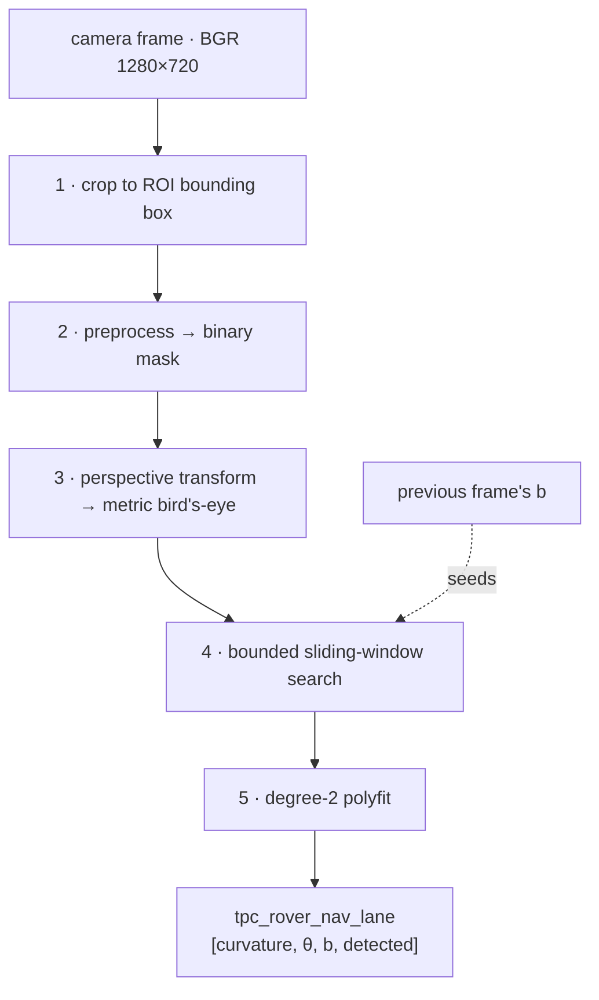

# Vision Pipeline

> **This documents the ROS 2 system that branch `rs` replaced.** The pipeline
> itself is ported behaviour-preservingly into
> `perception/rover_perception/lane.py`, which cites this document by section;
> the ROS wrapper described here (`lane_detection_node.py`) is gone, its
> frame-to-frame state folded into `LaneDetector`. Camera capture and
> detection now run in one process, so the `tpc_rover_d415_rgb` hop this
> document ends at no longer exists.


How a camera frame becomes the three numbers the steering loop consumes.
This document ends where [CONTROL_LAW.md](CONTROL_LAW.md) begins — at the
`tpc_rover_nav_lane` topic. The D4/D5/D6 domain topology and the `tpc_*`
schemas this document references were deleted with the ROS 2 tree — recover
them from the ROS 2 fallback repository, `RoboticsGG/almondmatcha`'s `main`
branch (this repository's `origin` has no `main` at all):
`git show roboticsgg-almondmatcha/main:docs/DOMAINS.md` and
`git show roboticsgg-almondmatcha/main:docs/TOPICS.md`, naming that remote
explicitly. For current wire types see `crates/rover-msgs`; for the machines
and IPs those domains used to run on see [HARDWARE.md](HARDWARE.md).

**Files:**
`ws_jetson/src/vision_navigation/vision_navigation/lane_detector.py` (the
pipeline itself, pure functions, no ROS) and `lane_detection_node.py` (the ROS
wrapper: parameters, frame-to-frame state, publishing, CSV logging).
`regenerate_roi.py` recomputed the §0/§1 geometry from the mount — see
"Regenerating the ROI" below.
**Config:** `ws_jetson/src/vision_navigation/config/vision_nav_headless.yaml` /
`ws_jetson/src/vision_navigation/config/vision_nav_gui.yaml` (deleted with the
ROS 2 tree).

---

## Overview



The pipeline detects **one** painted line and reports where it is and which
way it runs. It does not identify *which* line it found — see
[§4](#4-bounded-sliding-window-search), which is the whole reason the search
is bounded.

---

## 0. Camera geometry

Everything downstream is derived from the physical mount, so this is the
first thing to re-check if the rover is rebuilt.

| Quantity | Value |
|---|---|
| Camera | Intel RealSense D415, **colour** stream (`rs.stream.color`) |
| Height above ground | 0.50 m |
| Tilt | 15° down from horizontal (±3° mounting tolerance — the geometry below uses the nominal 15°) |
| Lateral position | on the rover's lateral centreline |
| Longitudinal position | 8 cm **behind** the front axle |
| Wheelbase | 0.4875 m |
| Capture resolution | 1280 × 720 (16:9, so the full sensor FOV is used) |

A pixel `(u, v)` maps to a ground point `(X, Z)` — `X` lateral, `Z` forward
from the camera — by intersecting its ray with the ground plane:

$$
\mathbf{d}_c = \left(\tfrac{u-c_x}{f_x},\; \tfrac{v-c_y}{f_y},\; 1\right)
\qquad
\begin{aligned}
d_y &= \tfrac{v-c_y}{f_y}\cos\phi + \sin\phi \\
d_z &= -\tfrac{v-c_y}{f_y}\sin\phi + \cos\phi
\end{aligned}
\qquad
t = \frac{h}{d_y}
$$

giving `X = t·(u−c_x)/f_x` and `Z = t·d_z`, with `h = 0.50 m` and
`φ = 15°`. The horizon (where `d_y = 0`) sits at row **112 of 720** — the
lower ~78% of the frame is ground (at the previous 20° mount this was row 23;
the shallower tilt pushes the horizon further down the frame).

What the camera actually covers (recomputed with `regenerate_roi.py`, deleted
with the ROS 2 tree — see "Regenerating the ROI" below for the recovery
command and the formulas it used for this table):

| | row | distance ahead | ground width visible |
|---|---|---|---|
| bottom of frame | 720 | 0.68 m | 1.09 m |
| **ROI near edge** | 458 | **1.30 m** | 1.92 m |
| **ROI far edge** | 270 | **3.00 m** | 4.19 m |

> **Correction (2026-08-04):** the previous version of this table listed
> 1.43 m / 3.85 m for the ROI near/far edge widths. Those numbers belonged to
> a different distance (0.92 m — see the near-field example below) and were
> never valid for the actual ROI edges; the "why the ROI starts 1.30 m out"
> reasoning immediately below this table already used the correct **±0.96 m**
> figure (1.92 m total) for the near edge, so the two were self-contradictory.
> Recomputed and re-verified against the ROI corner pixel positions below.

> **Intrinsics caveat.** `f_x ≈ 924`, `f_y ≈ 925` at 1280×720 are derived from
> the datasheet FOV (69.4° × 42.5°), **not** read from the device.
> `camera_stream_node` opens the colour stream but never calls
> `get_intrinsics()`. If the real values differ by more than a few percent,
> every ROI corner below shifts. Reading them from the SDK and publishing a
> `CameraInfo` is the correct fix.

---

## 1. ROI and crop

**`get_scaled_roi_points()` → `crop_to_roi()`**

`roi_base_points` is a trapezoid authored at 1280×720 and scaled to the live
resolution at runtime. It is **not** hand-drawn — it is the image projection
of a ground **rectangle**:

```
X = -0.90 .. +0.90 m   (lateral, 1.80 m wide)
Z =  1.30 ..  3.00 m   (forward from the camera, 1.70 m deep)
     = 1.22 .. 2.92 m ahead of the front axle
```

which projects to `[39, 458, 1241, 458, 915, 270, 365, 270]`.

Because the source region is a true ground rectangle, the warp in
[§3](#3-perspective-transform--metric-birds-eye) is a genuine rectification:
parallel lines on the track stay parallel in the bird's-eye view.

The frame is then cropped to that trapezoid's bounding box plus
`crop_margin_px` (20 base px), which trims the unwanted surroundings *before*
the per-pixel work in §2 runs. At 960×540 that is 159k px instead of 518k.
Unlike lowering the capture resolution, cropping does not reduce pixel density
inside the ROI, so it costs no fitting accuracy.

> **Why the ROI starts 1.30 m out rather than at the rover.** Near-field
> width is FOV-limited: at 0.92 m the camera sees only 1.41 m across, which
> leaves ±9.5 cm of drift before an outer painted line falls outside the ROI.
> Moving the near edge to 1.30 m widens that to ±0.96 m of coverage and
> ±35 cm of drift budget, at no CPU cost. The price is that the reported
> geometry is a **lookahead** measurement (see [§5](#5-lane-fit)).
>
> These widths barely move with the mount's tilt angle (they were 1.43 m /
> 1.93 m respectively at the previous 20° tilt) — horizontal FOV is nearly
> independent of vertical pitch. What moves substantially with tilt is
> *which row* these distances land on (see the horizon-row and coverage-table
> changes above), which is why the ROI corner pixels needed recomputing even
> though the practical drift-budget conclusion barely changed.

### Regenerating the ROI

**`regenerate_roi.py` was deleted with the ROS 2 tree** (it lived at
`ws_jetson/src/vision_navigation/vision_navigation/regenerate_roi.py`).
Recover it from the ROS 2 fallback repository, `RoboticsGG/almondmatcha`'s
`main` branch — this repository's `origin` has no `main` branch, so name the
other remote explicitly:

```
git show roboticsgg-almondmatcha/main:ws_jetson/src/vision_navigation/vision_navigation/regenerate_roi.py
```

It took the physical mount as CLI arguments (defaults to the then-shipped
geometry) and printed the ROI corners, `k_ff`, the horizon row, and the
coverage table above, ready to paste into `config.py` and both
`vision_nav_*.yaml` files. It replaced a hand-computation process — the ROI
corners recomputed with a calculator and hand-typed into three files every
time the mount changed — which is exactly the kind of arithmetic that
silently drifts out of sync: the corrected coverage-table numbers above are a
transcription error from that hand process, unnoticed until this pass
cross-checked it against the script. If the mount changes again and the
script isn't restored first, the formulas below are for **checking** a
hand-recomputed result, not a substitute for it. The script implements the
same math:

$$
u = c_x + f_x\frac{X}{h\sin\phi + Z\cos\phi}
\qquad
v = c_y + f_y\frac{h\cos\phi - Z\sin\phi}{h\sin\phi + Z\cos\phi}
$$

applied to the four ground corners in order
`[bottom-left, bottom-right, top-right, top-left]`, at the 1280×720
authoring base — see `ground_to_pixel()` / `compute_roi_points()` in the
script for the runnable version.

---

## 2. Adaptive color segmentation → shape-filtered line mask

Replaced a fixed-threshold LAB-green-removal + Sobel-gradient + `gray > 180`
white pipeline (see "History" below) after auditing it against a phone photo
of the actual track: it does no positive red-surface segmentation at all
(the background-removal step only zeroes *green*, so anything non-green —
sky, sunlit concrete, water glare — passes straight through to the gradient
stage), and a sun-glare patch on the red surface reads at almost the same
HSV brightness/saturation as real white paint, so a fixed brightness
threshold cannot tell them apart regardless of where the cutoff is set.

**`segment_track_colors()`** — operates on the cropped BGR frame, returns
`(red_track_mask, white_mask)`, both `uint8` 0/1.

| Step | Operation | Purpose |
|---|---|---|
| 1 | `BGR → LAB` | `A` (red↔green) for the red split, `L*` (lightness) for the white split |
| 2 | Otsu threshold on `A` | Red-vs-not-red, re-fit **per frame** — see "Why adaptive" below |
| 3 | `MORPH_CLOSE` then `MORPH_OPEN`, 9×9 ellipse | Bridge shadow/gravel-texture gaps, then drop speckle |
| 4 | Dilate red mask ×2 → `near_track` | Restrict the white histogram to pixels on/near the track, so bright grass or a dirt-bank highlight elsewhere in the ROI can't shift the cut |
| 5 | `L*`, Otsu threshold within `near_track` | White-vs-red, by **brightness** — see below |
| 6 | Corridor = largest connected component of `(red \| white)` | Rejects unrelated red/white objects elsewhere in frame — **must** union red and white before taking "largest", see bug note below |
| 7 | `red_track_mask = corridor & red & ~white`, `white_mask = corridor & white` | Final split |

**Why adaptive, not fixed constants (steps 2, 5):** a threshold tuned against
one camera's color pipeline — its white balance, saturation curve, JPEG
compression — does not transfer to a different sensor looking at the same
physical track. Otsu re-fits both splits to whatever the current frame's own
histogram looks like instead of a number hand-picked from one test image.
This does not, by itself, fix a color collision *within* one frame (nothing
operating on a single pixel's color can) — that is what the BEV shape filter
below is for.

**Why brightness, not chroma, for white (step 5):** the original design here
used chroma distance from neutral gray (`sqrt((A-128)²+(B-128)²)`) instead of
`L*`, on the reasoning that the red track spans a huge `L*` range under
directional sun (deep shadow to glare highlight) that overlaps or exceeds
real white paint's brightness — that Otsu-on-`L*` would just split the track
into "its brighter half" and "its darker half" rather than finding
red-vs-white. That reasoning came from the mobile-phone audit photo only (see
"Known limits" below, as it stood before 2026-08-06). Validated against real
D415 footage on 2026-08-06 (`dev/` captures, 1280×720 @ 30 FPS) and found
backwards for this sensor: the D415 ROI's `A`/`B` channels span only ~35-40
levels total, too narrow for Otsu to find a real bimodal split there, so step
5 on chroma was misclassifying ~45% of the frame — most of the plain red
track — as white candidate, rather than the ~1-5% the actual painted lines
cover (confirmed: on the D415, red-channel Otsu alone already correctly
covers ~78% of the ROI as track, so the failure was isolated to the white
sub-step, not the red split in step 2). `L*` on the same footage has a clean
bimodal split (track ~110-115, paint >~170, close to the old pre-Otsu
pipeline's hardcoded `gray > 180` cutoff — Otsu-on-`L*` just makes that
adaptive per frame). `segment_track_colors()` uses `L*` now. This does not
reintroduce the sun-glare risk the phone audit found — see "Why adaptive"
above; the BEV shape filter below still carries that job, unchanged.

**Corridor bug (step 6):** taking "the single largest red-only blob" breaks
because the white centre line cuts the track into a left half and a right
half — connectivity on red alone silently kept only the larger of the two and
reported the other as background. Fixed by unioning red and white before
computing connected components, then splitting them back out afterward.

**`filter_line_candidates_bev()`** — runs downstream, in the metric BEV
canvas (§3), not here. Chroma/brightness alone cannot separate a sun-glare
patch from real paint when the two happen to be genuinely close in color —
confirmed empirically (HSV ~S=55-60, V=185-195 for both, on the audit photo).
The white mask from this step is deliberately over-inclusive; shape is what
rejects the false positives:

1. **Per-row run-width prune.** Opening with a purely horizontal
   `(max_width_px+1) × 1` kernel keeps only pixels belonging to a run at
   least that wide *in their own row*; subtracting that from the original
   mask removes exactly the too-wide runs. This matters because a glare
   patch touching a real line with no color gap between them 8-connects into
   ONE component with it — a whole-component width test would then keep or
   reject the glare pixels *and* the genuine line pixels together. The
   per-row test only removes the actually-wide part of the run, so a line
   that briefly touches a wider blob keeps its own thin rows instead of
   losing the whole component.
2. **Depth persistence + aspect, on what survives step 1.** A real line runs
   the length of the ROI (tall) and stays within its true width start-to-end
   (narrow); reject anything that doesn't clear `min_height_frac × bev_height`
   and `min_aspect`. This drops isolated speckle that happens to be
   thin-at-a-single-row but doesn't form an actual line.

This is a **geometric** test evaluated in the metric top-down view, not a
color one — it holds regardless of which camera or lighting produced the
color-stage candidates above. It must run in BEV, not the raw camera frame:
in the raw perspective, lines converge and shrink with distance, so a fixed
width/aspect rule can't tell "thin far line" from "thick near glare" — they
overlap in raw pixel dimensions.

**Validated against real D415 footage 2026-08-06.** The design sample was a
mobile-phone photo, not the D415 (see "Why brightness, not chroma" above for
why step 5 didn't transfer). Validated using
`test_lane_pipeline_video.py` (same package) against two D415 recordings in
`dev/` (1280×720 @ 30 FPS, one short clip and one full round-trip lap) —
before the `L*` fix, detection rate was ~1% of frames; after, ~90% on the
short clip, with the fitted line visually tracking the painted centre line
in the overlay output. The *architecture* (adaptive per-frame splits, BEV
shape filter) held up; only the white sub-step's feature channel needed to
change. Still open: `SEGMENTATION_MORPH_KERNEL_PX` and
`MIN_LINE_COMPONENT_AREA_PX` remain picked by eye against the phone photo,
not re-derived from a D415 measurement (see `config.py`) — they produced
clean masks in this validation but haven't been swept against a range of
values. Only one lighting condition (overcast, the conditions the two `dev/`
recordings were captured in) has been validated; re-check under strong
directional sun before trusting this unattended.

### History

The previous pipeline used a fixed LAB green mask + Sobel gradient +
`gray > 180` white threshold (`preprocess_frame()`, since removed).
`MIN_CONTOUR_AREA` was already dead by that point (a 3×3 morphological
opening had replaced the per-contour area filter it recorded) and has been
removed along with the rest of the fixed-threshold constants (`LAB_GREEN_*`,
`LAB_RED_*`, `GRADIENT_SOBEL_*`, `MAGNITUDE_*`, `DIRECTION_*`,
`WHITE_THRESHOLD`) — none were read anywhere outside `config.py` itself.

---

## 3. Perspective transform → metric bird's-eye

**`perspective_transform()`**

The ROI trapezoid is mapped onto a **fixed** canvas (`bev_width_px` ×
`bev_height_px` = 720 × 340), *not* onto the crop dimensions. The ROI occupies
the middle 50% of the canvas width (`PERSPECTIVE_LEFT/RIGHT_MARGIN` = 0.25 /
0.75), so:

$$
S = \frac{0.5 \cdot 720\ \text{px}}{1.80\ \text{m}}
  = \frac{340\ \text{px}}{1.70\ \text{m}}
  = 200\ \text{px/m in both axes}
$$

**Isotropy is the point.** Sizing the canvas from the crop made the view
2.45× wider than tall per metre, which meant `theta` was not an angle at all
but a canvas-dependent number inflated by the aspect ratio — and its scale
changed silently whenever the ROI or the resolution was edited. With
`BEV_PX_PER_M` fixed:

| Signal | Physical meaning |
|---|---|
| `theta` | real heading angle, degrees |
| `b` | real cross-track offset, **metres** (converted from the fit's native BEV pixels by dividing by `BEV_PX_PER_M` at the point `compute_lane_params()` produces it) |
| `curvature` | arc in the fit's native BEV pixels (1/px), NOT converted here — `A = 1/(2·R·S)`, so `R = 1/(2·A·S)`; consumers needing a real radius fold `S` into their own formula |

This is also what makes the downstream clamps in `rover_kinematic_control`
meaningful: `θ ∈ [−35°, 35°]` is now ±35 real degrees, and `b ∈ [−0.50, 0.50] m`
is ±50 cm.

The canvas extends to ±1.8 m of ground even though the ROI spans ±0.9 m —
the homography is valid across the whole ground plane, so the extra margin
gives the search room to follow a line the rover has drifted away from.

---

## 4. Bounded sliding-window search

**`find_center_line()`**

Nine windows stacked bottom-to-top, each `±window_margin` wide. A window
recenters on the mean x of the pixels it contains if it has more than
`min_window_pixels`; otherwise it holds position and the next window up
starts from the same column.

The **start column** is the strongest column of the bottom-half histogram —
but only within `search_band_px` of `search_center`, which
`lane_detection_node` supplies as the previous frame's result:

```python
search_center = bev_width_px / 2 + b_previous_m * BEV_PX_PER_M   # detected frame
search_center = None  ->  canvas centre                          # lost frame, or startup
```

`b` is metres (see §5); `search_center` is a BEV pixel column, so the
conversion back to pixels here is not optional — mixing the two units
directly would seed the next frame's search a few centimetres of canvas away
instead of the intended offset.

### Why the search is bounded

This is the single most important constraint in the pipeline. The track has
**three parallel painted lines** — two lane edges and a centre line. Measured:
2.50 m red-edge-to-red-edge, lines 5 cm wide, centre line offset **±0.50 m**
from the track's own midpoint — not centred, and which side depends on the
rover's heading, so it cannot be assumed fixed. That makes the two
adjacent-line gaps **asymmetric**: 0.75 m on the near side, 1.75 m on the far
side (or the reverse). The detector has no concept of *which* line it is
looking at; an unrestricted `argmax` simply picks whichever carries the most
pixels that frame.

Measured on a ground-truth render with the rover perfectly centred on the
middle line, the three histogram peaks came out at **35.2% / 32.5% / 32.3%** —
a 2.7-point margin deciding which line the rover follows. Lighting, paint
wear, or the rover's own drift flips it, and each flip is a step change in `b`
of one line spacing (measured: **222 px from a 15 px real movement**, back
when `b` was still reported in BEV pixels), which saturated the downstream
clamp into a hard steering command. No low-pass filter can absorb it, because
it is a genuine step and not noise.

### Two hard constraints

Both are ceilings, not preferences. Both scale with `BEV_PX_PER_M`.

```
adjacent-line gaps (asymmetric) = 0.75 m and 1.75 m
binding constraint = the SMALLER one, always, since the offset direction
                      is not fixed -> 0.75 m x 200 px/m = 150 px

window_margin   < 75   (half the smaller gap)   -> shipped: 40
search_band_px  < 75   (half the smaller gap)   -> shipped: 45
```

(Supersedes an earlier 0.61 m / 122 px / 61 px derivation that assumed a
single, symmetric 1.22 m lane — that figure was never a real measurement of
this track; both shipped values remain valid, and now safer, under the
corrected ceiling.)

- **`window_margin` above half the smaller gap** lets one window capture two
  lines at once; `current_x = mean(x)` then lands in the empty gap between
  them and the fit is polluted by both.
- **`search_band_px` above half the smaller gap** lets the start-of-search
  histogram reach a neighbouring line, which is the wrong-line failure above.

`search_band_px` doubles as a rate limiter: the tracked line can appear to
move at most 45 px (22 cm) per frame, i.e. 6.7 m/s of lateral tracking at
30 fps.

> **If the track geometry changes, recompute both.** They are the only two
> parameters in the pipeline with a hard correctness ceiling rather than a
> tuning range.

**`max_abs_b_m` (absolute plausibility bound, 0.50 m).** The per-frame rate
limit above stops jumps but not a steady walk: a field log showed `b`
creeping from -46 to -230 px (under the old px-based reporting) over 19
frames while `detected` stayed true throughout, ending 1.15 m off the
rover's centreline and outside the ROI. `lane_detection_node` now rejects
any frame where `|b| > max_abs_b_m` — forcing `detected = false` and letting
the seed reset re-acquire from the canvas centre — since 0.50 m is also the
downstream `rover_kinematic_control` clamp, past which the value cannot
reach the controller unsaturated regardless of cause.

---

## 5. Lane fit

**`compute_lane_params()`**

Detected pixels are shifted into a frame with `y = 0` at the canvas bottom row
and `x = 0` at the canvas centre column, then fitted with a degree-2
polynomial:

$$
x = A y^2 + B y + C
$$

Fitting *in that frame* means the coefficients are directly the quantities the
controller needs, with no separate "evaluate the polynomial at `y = height`"
step:

| Output | From | Meaning |
|---|---|---|
| `curvature` | `A` | arc of the lane, BEV pixels (1/px); `R = 1/(2·A·S)` |
| `theta` | `degrees(arctan(B))` | heading angle of the lane |
| `b` | `C / BEV_PX_PER_M` | cross-track offset, **metres** (the fit's native `C` is BEV pixels; divided by `BEV_PX_PER_M` before being returned — `theta` needs no such conversion since `arctan` of a dimensionless slope is already a real angle) |
| `detected` | `len(x) ≥ min_lane_pixels` | validity |

`detected = False` publishes `curvature = theta = b = 0.0`. **NaN is never put
on the wire**: `clamp(NaN, -100, 100)` used to collapse to `-100`, turning
every undetected frame into a full-scale left steering command. The consuming
side treats non-finite geometry as "not detected" rather than filtering it —
[CONTROL_LAW.md](CONTROL_LAW.md) §1.1.

### `b` is a lookahead measurement

`y = 0` is the **near edge of the ROI**, which is 1.30 m ahead of the camera
= **1.22 m ahead of the front axle** — not the rover itself. So `b` is the
cross-track error at a point ahead of the rover, which on a curve is non-zero
even when the rover is perfectly on the line.

That is a usable, pure-pursuit-like signal, but it means `b` and `curvature`
encode partly the same information — see [CONTROL_LAW.md](CONTROL_LAW.md) §1
for the tuning-order consequence.

---

## Output contract

`tpc_rover_nav_lane` (`std_msgs/Float32MultiArray`, Domain 6,
Jetson-localhost only):

```
[0] curvature   float32   A coefficient, BEV pixels (1/px), 1/(2·R·200)
[1] theta       float32   degrees
[2] b           float32   metres
[3] detected    float32   1.0 / 0.0
```

Also logged per frame to `<ws_jetson>/runs/run_NNN_<stamp>/lane_detection.csv`
as `timestamp, curvature, theta, b, detected, fps`, written on a background
thread so the image callback never blocks on disk. `fps` is measured
throughput over a 30-frame rolling window, not the configured capture rate.

---

## Parameter reference

`lane_detection` block of
`ws_jetson/src/vision_navigation/config/vision_nav_headless.yaml` /
`vision_nav_gui.yaml` (deleted with the ROS 2 tree, see above). Defaults lived
in `LaneDetectionConfig` (`vision_navigation/config.py`) and **were** kept in
sync with those YAML files while the ROS 2 tree existed. That file now
survives only as the frozen parity oracle at
`perception/tests/oracle/config.py`, whose entire purpose — per
`perception/tests/oracle/README.md` — is that it is never synced or edited
again.

| Parameter | Value | Notes |
|---|---|---|
| `roi_base_points` | `[39,458, 1241,458, 915,270, 365,270]` | Derived from the mount via `regenerate_roi.py` (deleted with the ROS 2 tree — see "Regenerating the ROI" above); don't hand-edit without it |
| `roi_base_width` / `_height` | 1280 / 720 | Authoring base for the above |
| `crop_margin_px` | 20.0 | Trims unwanted surroundings, in base units |
| `bev_width_px` / `bev_height_px` | 720 / 340 | Fixes the scale at 200 px/m |
| `sliding_windows` | 9 | Window height = 340/9 ≈ 38 px |
| `window_margin` | 40 | **Hard ceiling 75** — half the smaller adjacent-line gap (0.75 m) |
| `search_band_px` | 45.0 | **Hard ceiling 75** — half the smaller adjacent-line gap (0.75 m) |
| `min_window_pixels` | 50 | Recenter threshold |
| `min_lane_pixels` | 50 | Validity threshold |
| `max_abs_b_m` | 0.50 | Absolute plausibility bound on fitted `b` (metres); past it the frame is rejected (`detected` forced false) and the seed resets |

---

## Verification

> **Needs re-running against the current mount.** The results below were
> measured against a ground-truth render built from the *previous* geometry
> (50 cm height, 20° tilt, 7 cm behind the front axle). The mount has since
> moved to 15°±3° tilt, 8 cm behind the front axle (§0) — the render, and
> everything in this section, should be redone against the new geometry
> before being trusted as a validation of the current ROI. The pipeline
> logic itself (§§1–5) did not change, only the physical constants, so the
> *method* here is still correct; only the specific numbers below are stale.

Measured against a ground-truth render built from the §0 geometry — lines
placed at known ground coordinates, then projected into the image:

| Check | Result |
|---|---|
| `b` vs true cross-track offset | accurate to **2 mm** over ±30 cm |
| `theta` on a straight, centred lane | **0.00–0.18°** (no residual bias) |
| Fitted radius, true `R` = 36.5 / 20 / 10 m | **37.0 / 19.7 / 10.0 m** |
| `theta` on a bend, `R` = 36.5 m | −2.01° (geometric truth −2.04°) |
| Wrong-line lock-on, −50→+50→−50 cm sweep, 43 frames | **0 frames** on the wrong line |
| Cold-start acquisition range | ±25 cm; ±30 cm reports *not detected* |

---

## Known limits

- **Cold start beyond ±25 cm** of the centre line can latch onto a boundary
  line. The seed resets on every lost frame, so a lost-then-reacquire while
  badly off-centre is the exposure. At ±30 cm the failure is safe (*not
  detected*); beyond ±40 cm it can acquire the wrong line. Start the rover
  within ~20 cm of the centre line. Measured at the previous 20° mount; since
  the near-field ground width barely changes with tilt (see §1), this is
  likely still close, but hasn't been re-measured at the current 15° mount.
- **Intrinsics are assumed, not measured** (§0). The highest-value pre-run
  check used to be launching with
  `ws_jetson/src/vision_navigation/config/vision_nav_gui.yaml` (deleted with
  the ROS 2 tree, see the top of this document) and confirming the ROI
  trapezoid lands on the track with all three lines inside it — that
  validated the intrinsics and the mount angle together. On this branch that
  check has no equivalent yet.
- **The pipeline tracks one line.** Using all three (fitting each and taking
  the midpoint of the two edges) would be substantially more robust and would
  degrade gracefully under occlusion, but is not implemented.
- **`demo_lane.py` is not this pipeline.** It carries its own independent
  `process_frame` and homography and does not reflect node behaviour.
- **§2's color splits still assume a red track / white paint scene.** They
  are adaptive (Otsu, re-fit per frame) rather than fixed, but still need
  *something* red and *something* white-on-red to split against — a
  different track color scheme would need re-deriving which channel
  discriminates it, not just new numbers.
- **§2 is validated against the D415, but only under overcast light**, and
  `SEGMENTATION_MORPH_KERNEL_PX` / `MIN_LINE_COMPONENT_AREA_PX` are still
  picked by eye against the original phone photo rather than re-derived from a
  D415 measurement. §2's "Validated against real D415 footage" has both in
  full. Re-check under strong directional sun before trusting it unattended.
- **A sun-glare patch on the track can still cost partial detection.** The
  color stage cannot separate a bright, desaturated glare reflection from
  real white paint when the two are genuinely close in color — confirmed on
  the audit photo (HSV ~S=55-60, V=185-195 for both). The BEV shape filter
  rejects the glare's own broad shape, but where glare directly overlaps the
  line's pixels with no color gap between them, that stretch of the line is
  correctly dropped rather than guessed at, leaving a gap in that frame's
  detected points. `min_lane_pixels` and the sliding-window hold-position
  behavior are what keep a partial gap from becoming a lost frame; a glare
  patch large enough to blank out most of the ROI's depth still would.
